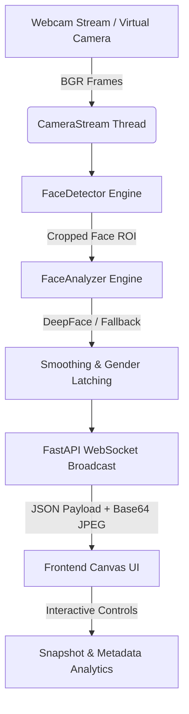

# 👁️ AURA Vision - AI Age, Gender & Emotion Detection System

[](https://www.python.org/downloads/)
[](https://fastapi.tiangolo.com/)
[](https://opencv.org/)
[](https://opensource.org/licenses/MIT)

AURA Vision is a high-performance, real-time computer vision system built with **FastAPI**, **OpenCV**, **DeepFace**, and **WebSockets**. It captures live webcam video streams, detects faces, predicts demographic & emotional attributes (Age, Gender, Emotion), and streams structured real-time analytics to a dark glassmorphic HTML5 Canvas frontend interface.

---

## 🌟 Key Features

- **⚡ Real-time Stream Processing**: Asynchronous threaded frame capture delivering up to 30 FPS.
- **🎯 Precise Face Detection**: OpenCV Haar Cascade detector with 25% dynamic bounding box padding for feature preservation.
- **🧠 Deep demographic & Emotion Analysis**: DeepFace integration predicting Age, Gender (Male/Female), and Emotion (Happy, Neutral, Sad, Angry, Surprise, Fear, Disgust).
- **🛡️ Anti-Flicker & Prediction Smoothing**:
  - **30-frame Sliding Window Majority Gender Latching** to prevent gender flickering across frames.
  - **Exponential Moving Average (EMA)** for smooth age and emotion distribution transitions.
- **🔄 Fallback Synthetic Generator**: Built-in animated webcam simulator if no physical webcam device is present.
- **🌐 Fullscreen Glassmorphism UI**: Live WebSockets stream overlay on dynamic Canvas, corner reticles, latency counter, and snapshot capture modal.

---

## 🏗️ System Architecture



---

## 📁 Repository Structure

```
Face-detection/
├── app/
│   ├── api/
│   │   ├── __init__.py
│   │   └── server.py          # FastAPI endpoints & WebSocket handler
│   └── vision/
│       ├── __init__.py
│       ├── analyzer.py        # DeepFace & EMA smoothing engine
│       ├── camera_stream.py   # Multi-threaded camera stream & fallback generator
│       └── face_detector.py   # OpenCV face detection & bounding box cropper
├── public/
│   ├── app.js                 # WebSocket client & Canvas renderer
│   ├── index.html             # Fullscreen HTML5 layout
│   └── style.css              # Glassmorphic UI styles
├── tests/
│   ├── __init__.py
│   └── test_vision.py         # Automated unit test suite
├── .gitignore
├── PROJECT_DOCUMENTATION.md   # Complete Technical Guide & Cyber/Industry Upgrade Blueprint
├── README.md                  # Quick Start & Overview
├── requirements.txt           # Python dependencies
└── run.py                     # One-click startup script with port auto-binding
```

---

## 🚀 Quick Start Guide

### Prerequisites
- Python 3.9 or higher
- Webcam / Camera hardware (optional; test generator activates automatically if missing)

### Installation

1. **Clone the Repository**
   ```bash
   git clone https://github.com/Satyasisir-06/Face-detection.git
   cd Face-detection
   ```

2. **Install Dependencies**
   ```bash
   pip install -r requirements.txt
   ```

3. **Launch Application**
   ```bash
   python run.py
   ```
   *The system automatically selects an available port (default `http://127.0.0.1:8000`) and launches your default browser.*

---

## 🧪 Testing

Run the automated unittest suite:
```bash
python -m unittest discover tests
```

---

## 🛰️ API Endpoint Reference

| Method | Endpoint | Description |
| :--- | :--- | :--- |
| `GET` | `/` | Serves live UI web interface |
| `GET` | `/api/status` | Returns system, webcam, and DeepFace model status |
| `GET` | `/api/snapshot` | Returns single frame capture + detected face analytics |
| `WS` | `/ws/stream` | Real-time WebSocket stream (25 FPS Base64 image + face metadata) |

---

## 🛡️ Future Upgrades: Thief & Suspect Identification Blueprint (Cyber & Security Industries)

For comprehensive details on expanding AURA Vision into a enterprise-grade criminal identification & cyber threat surveillance network, refer to [PROJECT_DOCUMENTATION.md](file:///e:/Projects/Face%20Recog/PROJECT_DOCUMENTATION.md).

### Roadmap Highlights:
1. **512D Vector Embeddings & Database**: Integration with ArcFace / FaceNet and Milvus/FAISS for sub-millisecond database searching across 1M+ suspect records.
2. **Real-time Criminal Watchlist Alert Engine**: Instant alert triggers (SMS, Webhooks, Telegram, SIEM) when similarity score exceeds set thresholds (e.g. >88%).
3. **Cyber Threat Intelligence & Multi-modal Integration**: Correlating facial detections at physical access terminals (ATMs, Server Rooms) with cyber logins & security logs.
4. **Anti-Spoofing & Liveness Detection**: 3D Depth & Infrared texture analysis to block photo/video spoofing attacks.
5. **Zero-Trust Security & Encryption**: AES-256 encrypted facial vectors and role-based access control (RBAC).

---

## 📄 License

Distributed under the MIT License. See `LICENSE` for more information.
